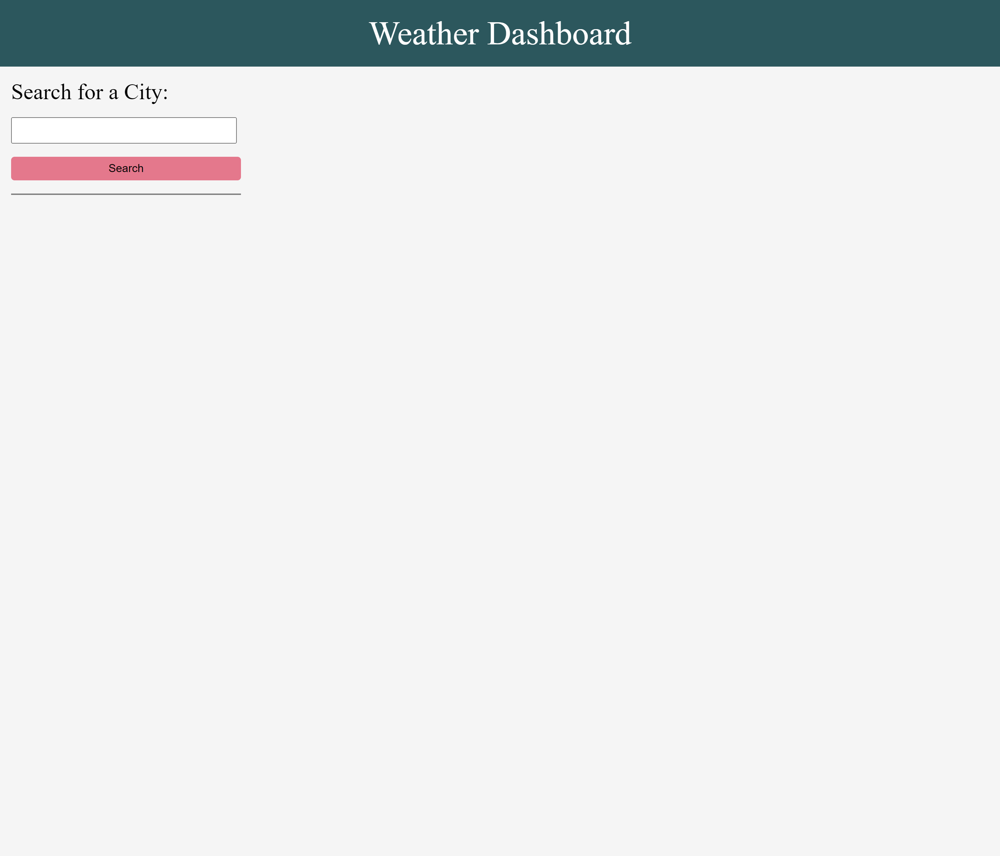
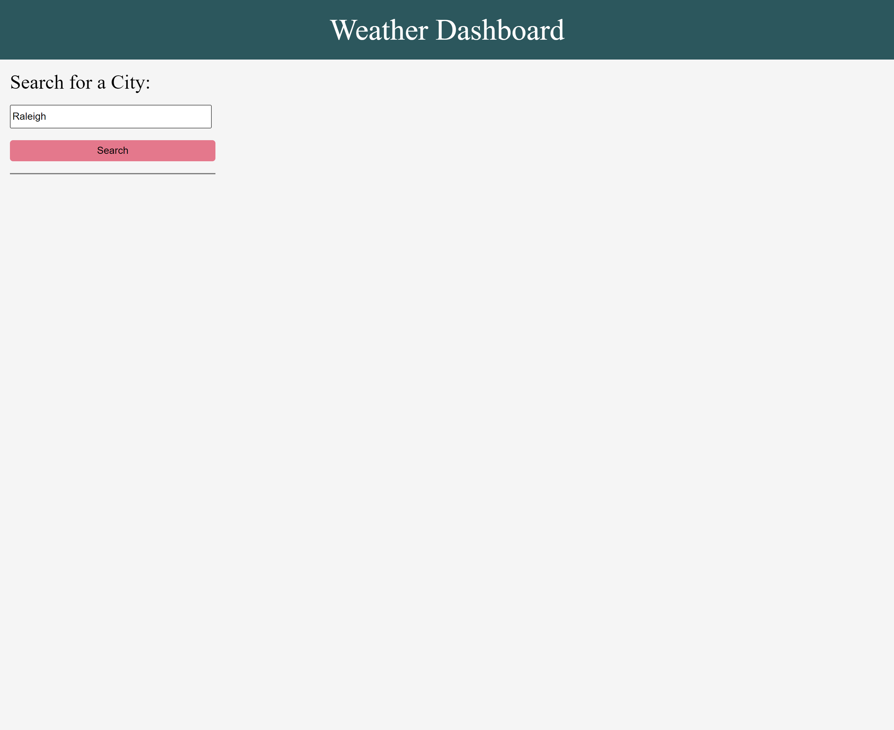
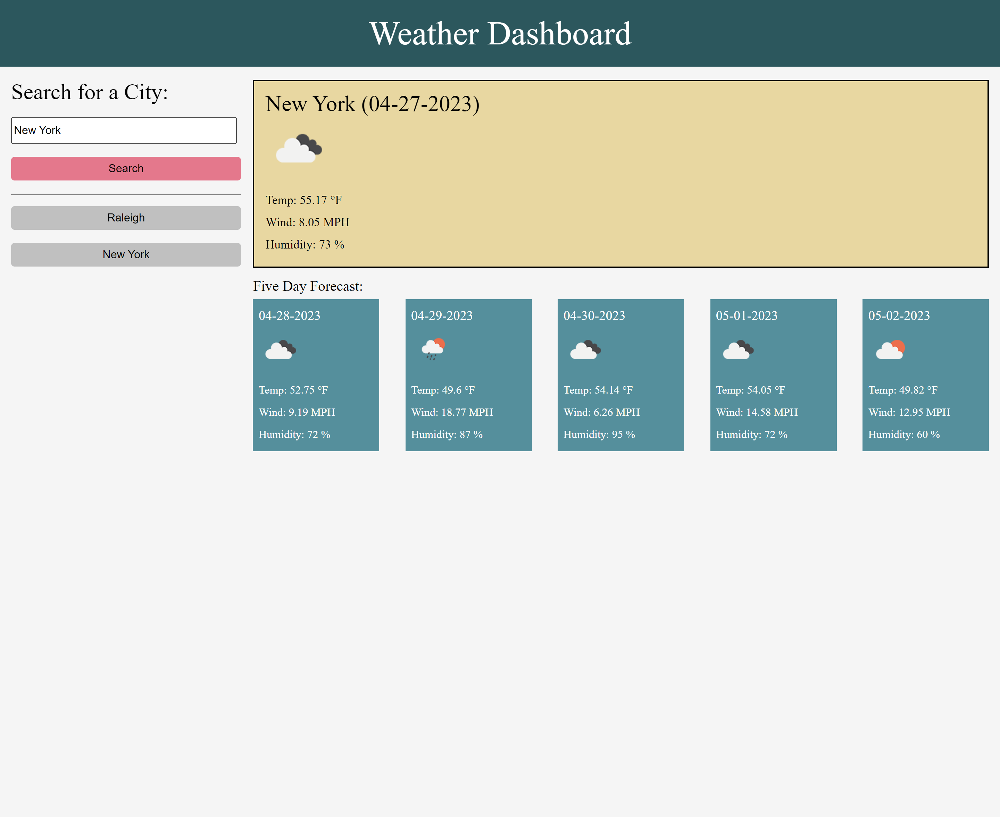
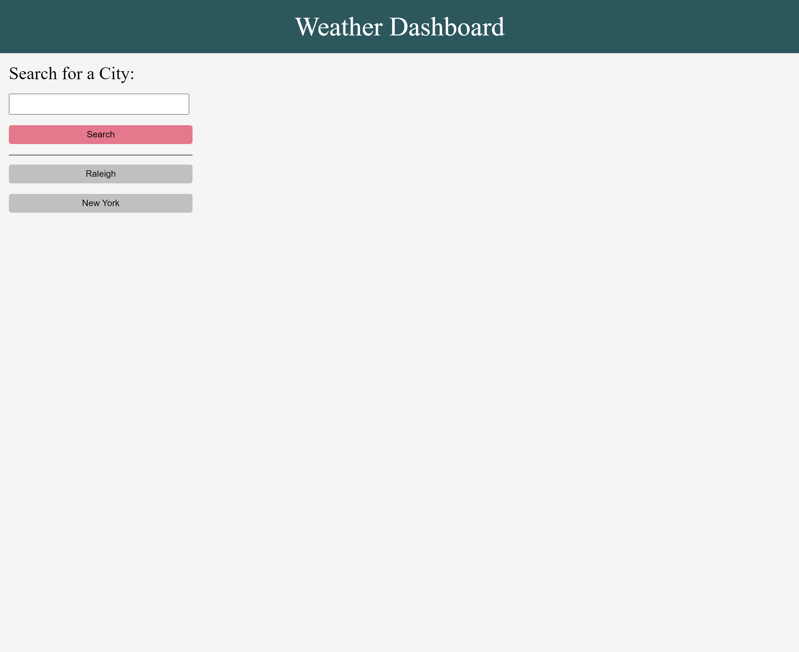
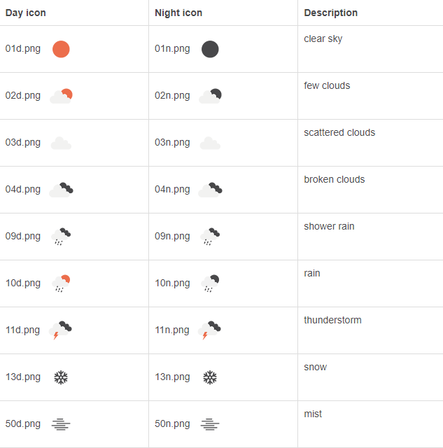
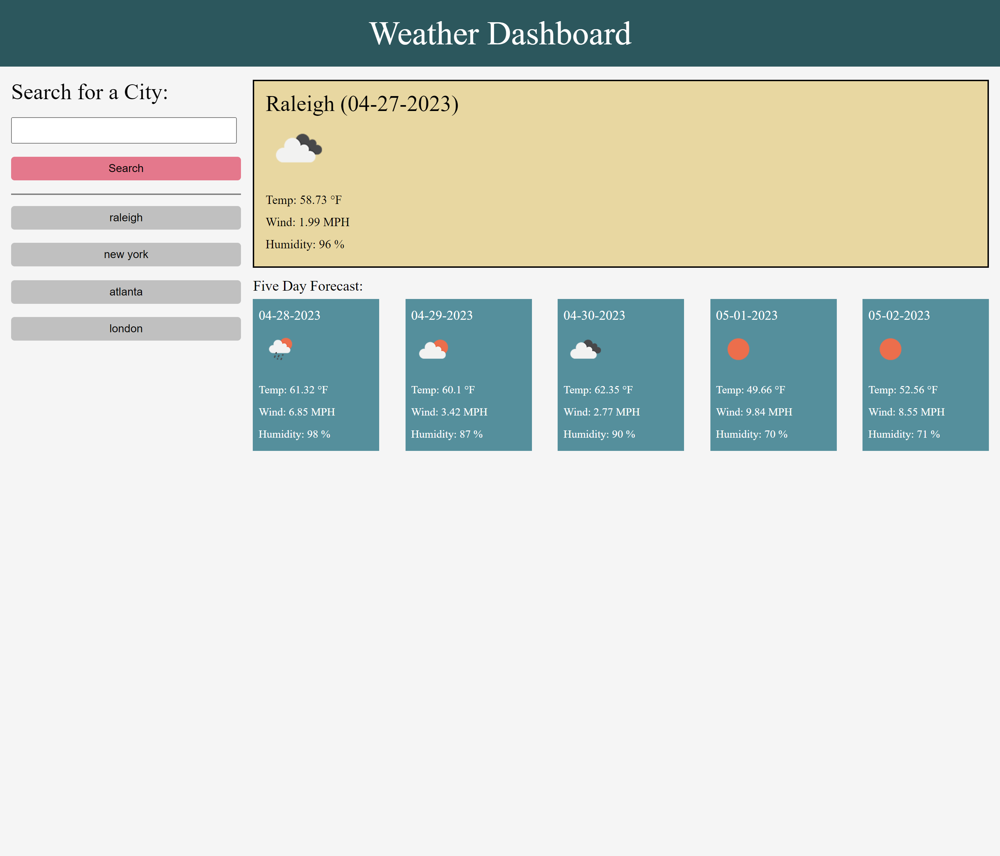

# Weather Dashboard

## About
This project began with the goal of creating a weather application that would display current and accurate weather data when searching for a city. Especially while traveling, it is a good idea to plan out your schedule around the weather. This app will let you search for a city, bring up that city's current weather, and show a five day forecast as well. The project makes API calls to the Open Weather API to obtain that information and generate it onto the page.

While building the app, I learned how to use fetch in order to make the Open Weather API call. I also became more familiar with how to read through API documentation, as I had to read the Open Weather API's documentation in order to figure out how it can even be used.

## Table of Contents
- [Installation](#installation)
- [Usage](#usage)
- [Deployed-Application](#deployed-application)

## Installation
All that is required is a device with access to an internet browser.
## Usage
Upon loading the page, you will be taken here:
### 

In the search bar, type in a valid city name. For example:
### 

Then click search and the weather data for the city entered will be rendered onto the page as so:
### 

To search a different city, just enter another city's name into the search bar and click search and you will see that city's weather data appear on the page.

As you make searches, your search history will be saved if a valid city was searched for. The search history will generate as you make searches, and render buttons onto the page in a list below the search button. As seen here:
### 

Click on one of your previous searches to bring up it's corresponding weather data, without having to type it into the search bar again.

Upon reloading the page, the search history will persist, as it is stored in the browser's local storage.

### 

Upon rendering the weather data, you will also see icons describing the current weather and forecasts.

Here is a list of the different icons that are used to depict the weather:
### 

## Deployed Application
**Live URL Here:** [_https://jebulger.github.io/weather-dashboard/_](https://jebulger.github.io/weather-dashboard/)

### 